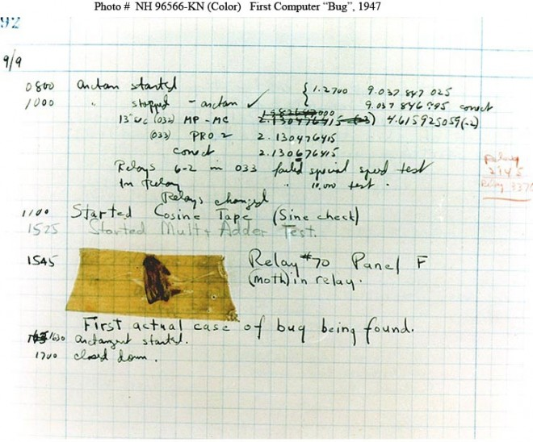

# Intermezzo: Debugging 1

_**This is a Makers Vine.** Vines are designed to gradually build up sophisticated skills. They contain a mixture of text and video, and may contain some challenge exercises without proposed solutions. [Read more about how to use Makers
Vines.](https://github.com/makersacademy/course/blob/main/labels/vines.md)_

Learn to debug simple and complex single-method programs.

## Introduction

Debugging literally means 'removing bugs'. The name comes from a story about the
computing pioneer Grace Hopper, who once tracked down a problem to a literal
bug, taping it to her report for good measure:



You can see from the above page that Hopper was following a methodical process.

Earlier we described test-driving and free-running development as two approaches
to creating software. In this exercise we will see the difference between
**Change Debugging** and **Discovery Debugging**. Change debugging works when
the problem is simple, but fails when the problem is complex.

## Exercise 1

Set a timer for 10 minutes.

Your challenge is to debug the program below before the timer goes off. When you
fix the program or the timer goes off, move on to the next exercise.

```python
def say_hello(name)
  return f"hello (name)"


# Intended output:
#
# > say_hello("kay")
# => "hello kay"
```

## Exercise 2

Set a timer for 10 minutes.

Your challenge is to debug the program below before the timer goes off. When you
fix the program or the timer goes off, move on to the next exercise.

  ```python

  def encode(text, key):
      text = list(text.replace(" ", ""))
      cipher = [chr(i+65) for i in range(0,25)]
      for x in key:
          x = x.upper()
          if x.upper() in cipher:
              cipher.remove(x)
          cipher.append(x)

      ciphertext_chars = []
      for i in text:
          ciphertext_chars.append(chr(65 + cipher.index(i.upper())))

      encrypted = "".join(ciphertext_chars)[::-1]
      return encrypted


  def decode(encrypted, key):
      cipher = [chr(i+65) for i in range(0,25)]
      for x in key:
          x = x.upper()
          if x.upper() in cipher:
              cipher.remove(x)
          cipher.append(x)
      
      plaintext = []
      encrypted = list(encrypted)[::-1]
      for i in encrypted:
          plaintext.append(cipher[ord(i)-65])

      return "".join(plaintext)


  # Intended output:
  #
  # > encode("theswiftfoxjumpedoverthelazydog", "secretkey")
  # => "EMBAXNKEKSYOVQTBJSWBDEMBPHZGJSL"
  #
  # > decode("EMBAXNKEKSYOVQTBJSWBDEMBPHZGJSL", "secretkey")
  # => "theswiftfoxjumpedoverthelazydog"
  ```

## Interlude: Methodical Debugging

_[A condensed video explanation of this section is here.](https://www.youtube.com/watch?v=JnoTLn2HYXE&t=0s)_

Exercise 2 probably felt hard. Most bugs are so easy we can solve them without
thinking. But most of the _time_ you spend debugging will be on the hard bugs.

This is why debugging is our third key engineering practice. The better you are
at debugging, the less time you spend not knowing what is going on, and the more
effective you will be both here and in industry.

It's time to explain Change Debugging and Discovery Debugging.

* **Change Debugging**  
  You figure there is a problem in the code, and so you stare at the code
  looking for the most suspicious-seeming part of it. You change that part and
  run the code to see if it works. If it doesn't, you keep looking for new
  changes to make.

  The problem with this style is that there are approximately an infinite number
  of changes you can make to any complex code. The chances of you landing on the
  right fix are very small, especially if you are inexperienced.

* **Discovery Debugging**  
  You focus instead on investigating and examining how the code executes, the
  flow of control, which ifs and loops run and how many times, the values of
  variables as they change through the program. You build up your understanding
  of what the program is doing until you're quite sure you understand the
  problem.

  You discover the bug first, and only then do you apply a change to fix it. If
  your change is wrong, you go back to discovery mode.

Both approaches are fine. If you can see the right change immediately and fix
it, that's great! But if you find your changes don't work or the code is
complex, Discovery Debugging is the right tool.

## Getting Visibility

Our most powerful tool for Discovery Debugging is 'getting visibility' — using
`p` to print out values in the program.

[Here is a demonstration of Getting Visibility](https://www.youtube.com/watch?v=JnoTLn2HYXE&t=353s). You may find the below code useful to refer to.

```python
def factorial(n):
  product = 1
  print(f"at the start product is {product}")
  while n > 0:
    n -= 1
    print(f"we multiply {product} by {n}")
    product *= n
    print(f"we get {product}")
  
  return product

```

## Exercise

Return to this example and debug it using Discovery Debugging.


  ``` python
  def encode(text, key):
      text = list(text.replace(" ", ""))
      cipher = [chr(i+65) for i in range(0,25)]
      for x in key:
          x = x.upper()
          if x.upper() in cipher:
              cipher.remove(x)
          cipher.append(x)

      ciphertext_chars = []
      for i in text:
          ciphertext_chars.append(chr(65 + cipher.index(i.upper())))

      encrypted = "".join(ciphertext_chars)[::-1]
      return encrypted


  def decode(encrypted, key):
      cipher = [chr(i+65) for i in range(0,25)]
      for x in key:
          x = x.upper()
          if x.upper() in cipher:
              cipher.remove(x)
          cipher.append(x)
      
      plaintext = []
      encrypted = list(encrypted)[::-1]
      for i in encrypted:
          plaintext.append(cipher[ord(i)-65])

      return "".join(plaintext)

  # Intended output:
  # > encode("theswiftfoxjumpedoverthelazydog", "secretkey")
  # => "DMBGXNKDKSYOVQTBJSWBEDMBPHZAJSL"
  #
  # > decode("DMBGXNKDKSYOVQTBJSWBEDMBPHZAJSL", "secretkey")
  # => "theswiftfoxjumpedoverthelazydog"

  ```

[Example Solution](https://www.youtube.com/watch?v=JnoTLn2HYXE&t=985s)

## Challenge

Debug this program.

```python 
>>> def get_most_common_letter(text):
...     counter = {}
...     for char in text:
...     	if char != " ":
...         	try:
...             	counter[char] += 1
...             except:
...                 counter[char] = 1
...     letter = sorted(counter.items(), key=lambda item: item[1])[0][1]
...     return letter

  

# Intended output:
# 
# >>> get_most_common_letter("the roof, the roof, the roof is on fire!")
# 'o'

```


[Next Challenge](05_test_drive_a_class.md)

<!-- BEGIN GENERATED SECTION DO NOT EDIT -->

---

**How was this resource?**  
[😫](https://airtable.com/shrUJ3t7KLMqVRFKR?prefill_Repository=makersacademy%2Fgolden-square-in-python&prefill_File=challenges%2F04_intermezzo_debugging_1.md&prefill_Sentiment=😫) [😕](https://airtable.com/shrUJ3t7KLMqVRFKR?prefill_Repository=makersacademy%2Fgolden-square-in-python&prefill_File=challenges%2F04_intermezzo_debugging_1.md&prefill_Sentiment=😕) [😐](https://airtable.com/shrUJ3t7KLMqVRFKR?prefill_Repository=makersacademy%2Fgolden-square-in-python&prefill_File=challenges%2F04_intermezzo_debugging_1.md&prefill_Sentiment=😐) [🙂](https://airtable.com/shrUJ3t7KLMqVRFKR?prefill_Repository=makersacademy%2Fgolden-square-in-python&prefill_File=challenges%2F04_intermezzo_debugging_1.md&prefill_Sentiment=🙂) [😀](https://airtable.com/shrUJ3t7KLMqVRFKR?prefill_Repository=makersacademy%2Fgolden-square-in-python&prefill_File=challenges%2F04_intermezzo_debugging_1.md&prefill_Sentiment=😀)  
Click an emoji to tell us.

<!-- END GENERATED SECTION DO NOT EDIT -->
